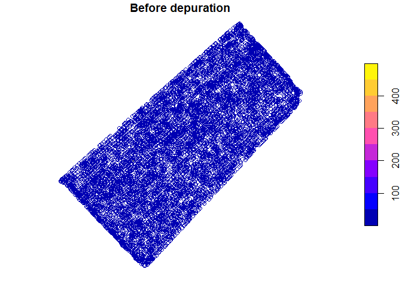

<!-- README.md is generated from README.Rmd. Please edit that file -->

# paar

<!-- badges: start -->

[](https://github.com/PPaccioretti/paar/actions)
[](https://lifecycle.r-lib.org/articles/stages.html#experimental)
<!-- badges: end -->

The goal of `paar` is to provide useful functions for precision
agriculture spatial data depuration.

## Installation

<!-- You can install the released version of paar from [CRAN](https://CRAN.R-project.org) with: -->
<!-- ``` r -->
<!-- install.packages("paar") -->
<!-- ``` -->

You can install the development version from
[GitHub](https://github.com/PPaccioretti/paar) with:

``` r
# install.packages("devtools")
devtools::install_github("PPaccioretti/paar")
```

## Example

The package has a complete protocol for automating error removal.
Default values of all functions are optimized for precision agricultural
data.

``` r
library(paar)
library(sf)
data("barley", package = 'paar')
```

`barley` data contains barley grain yield which were obtained using
calibrated commercial yield monitors, mounted on combines equipped with
DGPS.

``` r
#Convert barley data to an spatial object
barley_sf <- st_as_sf(barley,
                   coords = c("X", "Y"),
                   crs = 32720)

barley_dep <-
  depurate(barley_sf,
           "Yield")
#> Concave hull algorithm is computed with
#> concavity = 2 and length_threshold = 0

# Summary of depurated data
summary(barley_dep)
#>       normal point               border   spatial outlier MP   
#>         5978 (81%)            964 (13%)           343 (4.6%)   
#>         global min              outlier   spatial outlier LM   
#>          99 (1.3%)           6 (0.081%)           4 (0.054%)
```

Spatial yield values before and after depuration process can be plotted

``` r
plot(barley_sf["Yield"], breaks = 'quantile', main = "Before depuration")
plot(barley_dep$depurated_data["Yield"], main = "After depuration")
```



Also distribution of yield values can be plotted

``` r
boxplot(barley_sf[["Yield"]], main = "Before depuration")
boxplot(barley_dep$depurated_data[["Yield"]], main = "After depuration")
```


## References

-   Vega, A., Córdoba, M., Castro-Franco, M. et al. (2019). Protocol for
    automating error removal from yield maps. Precision Agric 20,
    1030–1044 <https://doi.org/10.1007/s11119-018-09632-8>
-   Paccioretti, P., Córdoba, M., & Balzarini, M. (2020). FastMapping:
    Software to create field maps and identify management zones in
    precision agriculture. Computers and Electronics in Agriculture,
    175, 105556 <https://doi.org/10.1016/j.compag.2020.105556>.
