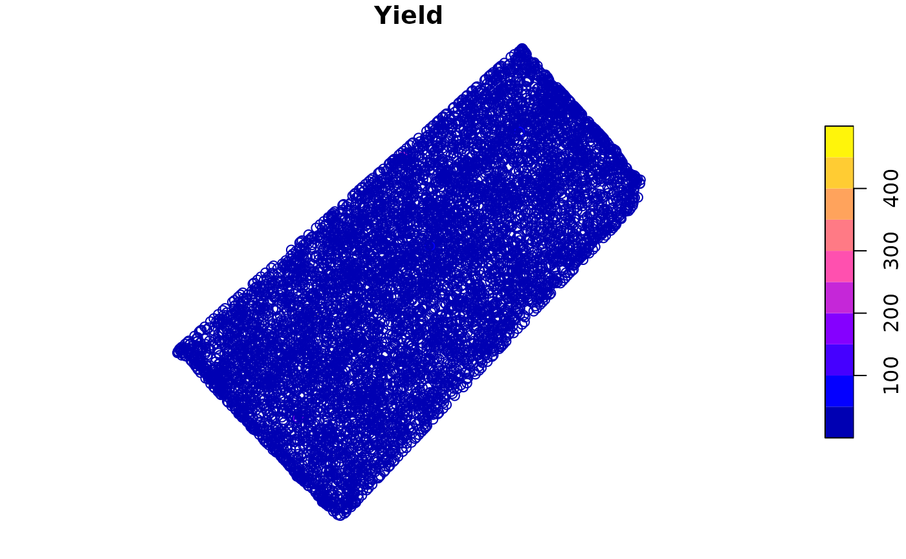
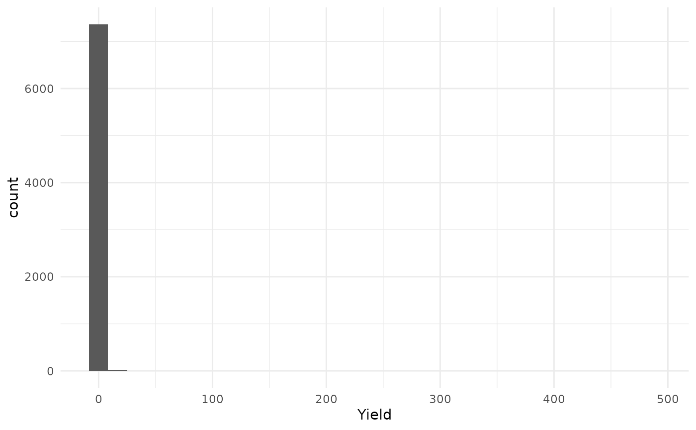
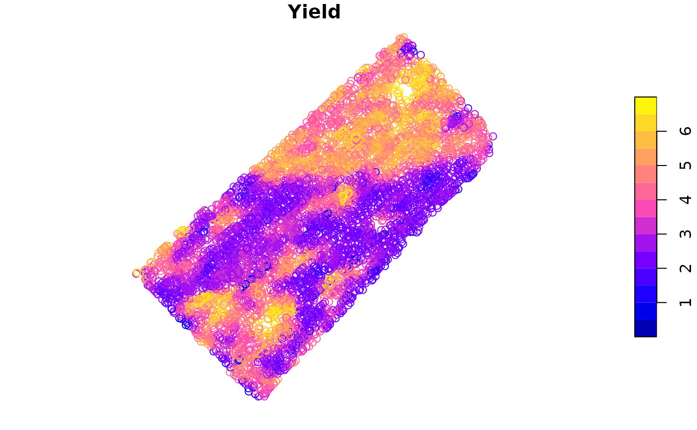
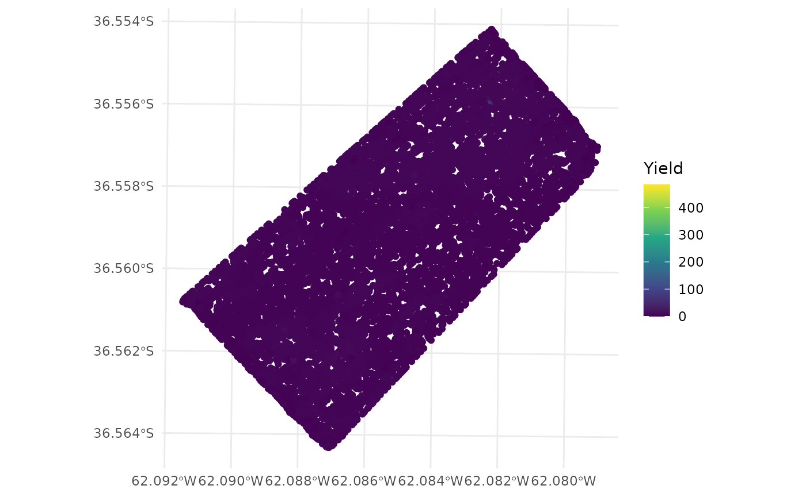
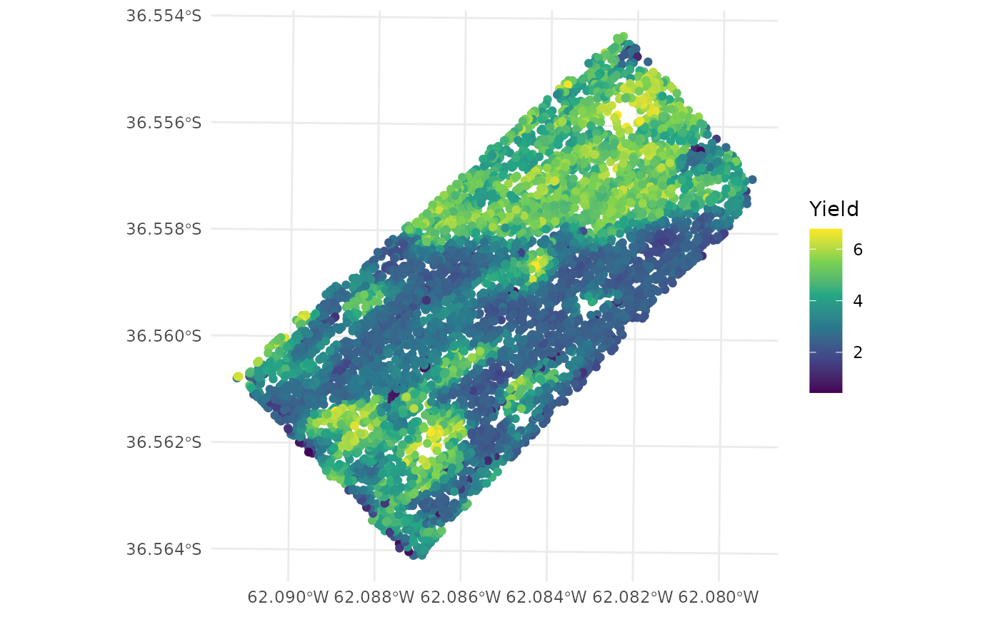
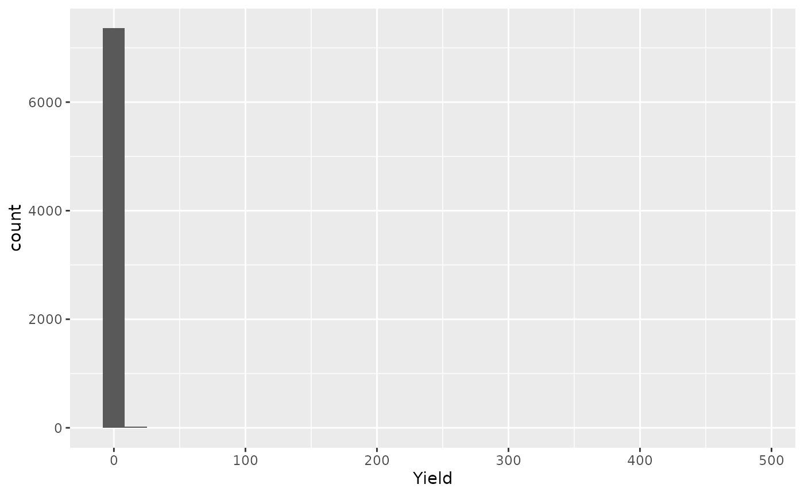
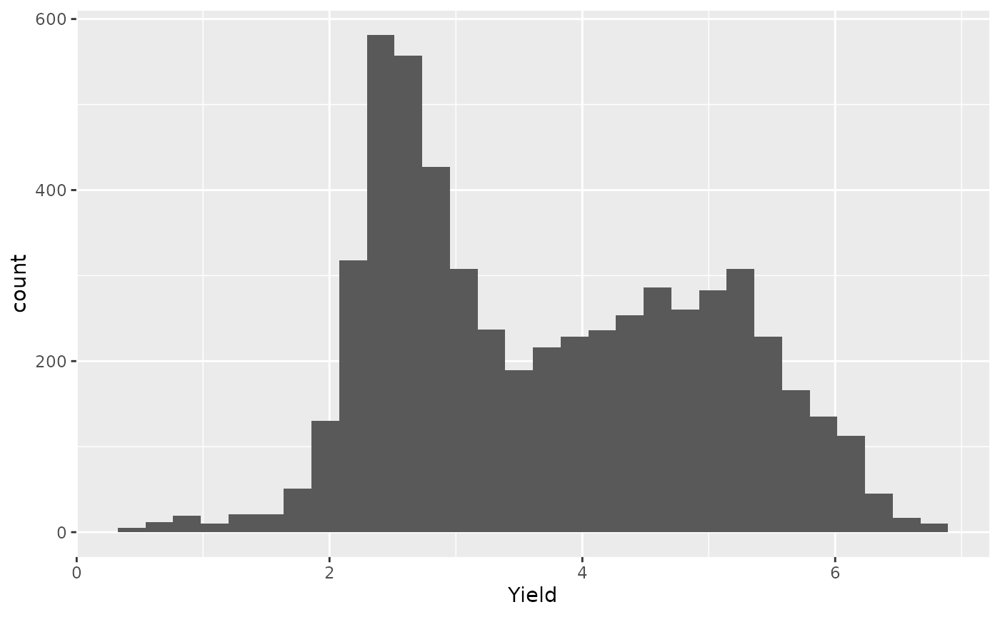
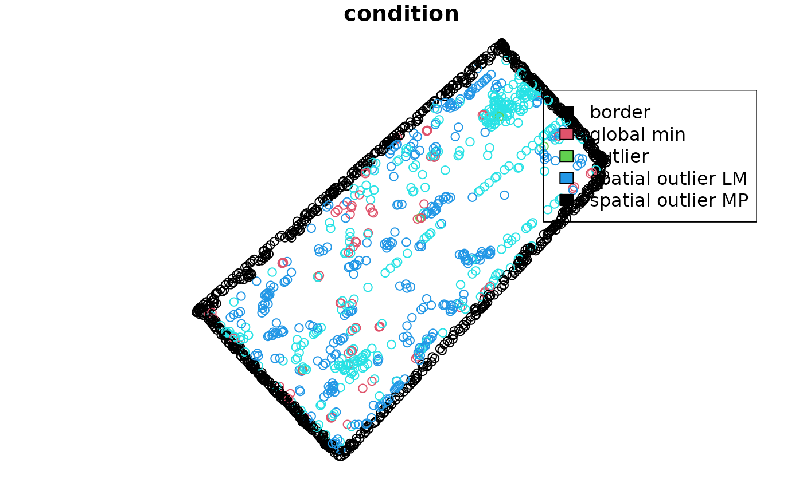
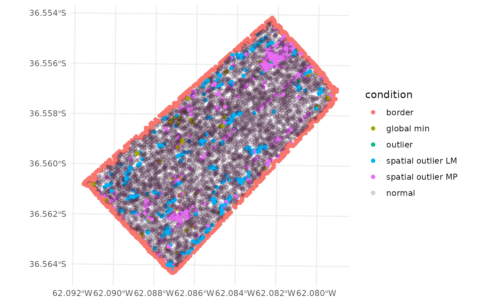

# Yield data preprocessing

Usually, yield data comes with many noisy observations. This vignette
will show how to preprocess yield data to remove both, spatial and
global outliers. The protocol for error removal follows the protocol
proposed by Vega et al. (2019). Functions from this package are used in
FastMapping software (Paccioretti, Córdoba, and Balzarini 2020). For the
tutorial we will use the `barley` dataset that comes with the `paar`
package. The `barley` data contains barley grain yield which were
obtained using calibrated commercial yield monitors, mounted on combines
equipped with DGPS. The data is not a `sf` object format. We will
convert it to an `sf` object first.

First, we will load the `paar` package, the `sf` package for spatial
data manipulation, `ggplot2` for plotting, and the `barley` dataset that
comes with the `paar` package.

``` r
library(paar)
library(sf)
#> Linking to GEOS 3.12.1, GDAL 3.8.4, PROJ 9.4.0; sf_use_s2() is TRUE
require(ggplot2)
#> Loading required package: ggplot2

data("barley", package = 'paar')
```

The `barley` dataset is a `data.frame` object. We will convert it to a
`sf` object using the `st_as_sf` function. The `coords` argument
specifies the columns that contain the coordinates. The `crs` argument
specifies the coordinate reference system. The `barley` dataset is in
UTM zone 20S.

``` r
barley_sf <- st_as_sf(barley, 
                      coords = c("X", "Y"),
                      crs = 32720)
```

The `barley_sf` object is now an `sf` object. We can plot the data to
visualize the yield data.

- The `plot` function can be used to plot the data.

``` r
plot(barley_sf["Yield"])
```



- The `ggplot2` package can be used to plot the data.

``` r
ggplot(barley_sf) +
  geom_sf(aes(color = Yield)) +
  scale_color_viridis_c() +
  theme_minimal()
```


Let’s see the yield values distribution.

- The `hist` function can be used to plot the histogram.

``` r
hist(barley_sf$Yield, main = 'Yield values distribution')
```


- The `ggplot2` package can be used to plot the histogram.

``` r
ggplot(barley_sf) +
  geom_histogram(aes(x = Yield)) +
  theme_minimal()
#> `stat_bin()` using `bins = 30`. Pick better value `binwidth`.
```



The protocol proposed by (Vega et al. 2019), is implemented in the
function `depurate` and consists of three steps: 1. Remove border
observations (*edges*). 2. Remove global outliers (*outliers*). 3.
Remove spatial outliers (*inliers*).

The `depurate` function takes an `sf` object as input and returns an
object of class `paar`. Any combination of the three steps can be done
using the `depurate` function. The argument `to_remove` specifies which
steps to perform. The argument `y` specifies the column name of the
variable to be cleaned. A field boundary is necessary to remove the
*edges* observations. If a polygon is not provided in the `poly_border`
argument, the function will make a hull, around the data and remove the
observation that are 10m from the hull. The hull is made using
[`concaveman::concaveman`](https://joelgombin.github.io/concaveman/reference/concaveman.html)
function if the package is installed, otherwise, the
[`sf::st_convex_hull`](https://r-spatial.github.io/sf/reference/geos_unary.html)
function is used.

``` r
barley_clean_paar <-
  depurate(barley_sf, 
           y = 'Yield',
           toremove = c("edges", "outlier", "inlier"))
#> Concave hull algorithm is computed with
#> concavity = 2 and length_threshold = 0
```

## Summary of the cleaning process

The `depurate` function returns an object of class `paar`. The `paar`
object contains the cleaned data (`$depurated_data`), and the condition
of each observation (`$condition`). If the condition is `NA` means that
the observation was not removed.

``` r
barley_clean_paar
#> Depurated data has 5673 rows.
#> The process removed 23% of original data.
#> 
#> $depurated_data
#> Simple feature collection with 5673 features and 1 field
#> Geometry type: POINT
#> Dimension:     XY
#> Bounding box:  xmin: 581322.1 ymin: 5953094 xmax: 582393.3 ymax: 5954175
#> Projected CRS: WGS 84 / UTM zone 20S
#> First 3 features:
#>       Yield                 geometry
#> 3  2.566069 POINT (582393.3 5953877)
#> 36 3.217464 POINT (582373.4 5953843)
#> 37 2.651020 POINT (582375.7 5953846)
#> 
#> 
#> $condition
#> vector of length 7394. First 3 elements:
#> [1] "border" "border" NA
```

The `summary` function can be used to get a summary of the percentage of
considered outlier and the number of observations removed. The `summary`
function returns a `data.frame` object.

``` r
summary_table <- summary(barley_clean_paar)
summary_table
#>       normal point             border spatial outlier MP spatial outlier LM 
#>         5673 (77%)          964 (13%)         343 (4.6%)         309 (4.2%) 
#>         global min            outlier 
#>          99 (1.3%)         6 (0.081%)
```

Filtered dataset can be extracted from the `paar` object using the
`$depurated_data`

``` r
barley_clean <- barley_clean_paar$depurated_data
```

Final Yield values distribution can be plotted.

- The `plot` function can be used to plot yield values.

``` r
plot(barley_clean["Yield"])
```



- The `ggplot2` package can be used to plot yield values.

``` r
ggplot(barley_clean) +
  geom_sf(aes(color = Yield)) +
  scale_color_viridis_c() +
  theme_minimal()
```


A comparison can be made between the original data and the cleaned data.

- Original data

``` r
ggplot(barley_sf) +
  geom_sf(aes(color = Yield)) +
  scale_color_viridis_c() +
  theme_minimal()
```



- Cleaned data

``` r
ggplot(barley_clean) +
  geom_sf(aes(color = Yield)) +
  scale_color_viridis_c() +
  theme_minimal()
```



Also, the distribution of the yield values can be compared.

- Original data

``` r
ggplot(barley_sf, aes(x = Yield)) +
  geom_histogram()
#> `stat_bin()` using `bins = 30`. Pick better value `binwidth`.
```



- Cleaned data

``` r
ggplot(barley_clean, aes(x = Yield)) +
  geom_histogram()
#> `stat_bin()` using `bins = 30`. Pick better value `binwidth`.
```



## Plotting the condition of each observation

The condition of each observation can be combined to the original data
using the `cbind` function. The `paar` object must be used as first
argument in the `cbind` function.

``` r
barley_sf <- cbind(barley_clean_paar, barley_sf)
```

The `barley_sf` object now contains the condition of each observation.
The `condition` column contains the condition of each observation. The
condition can be `NA` if the observation was not removed, `edges` if the
observation was removed in the *edges* step, `outlier` if the
observation was removed in the *outliers* step, and `inlier` if the
observation was removed in the *inliers* step. Results can be plotted to
visualize the observations.

- The `plot` function can be used to plot the condition of each
  observation.

``` r
plot(barley_sf[,'condition'], col = as.numeric(as.factor(barley_sf$condition)))
legend("topright", legend = levels(as.factor(barley_sf$condition)), fill = 1:4)
```



- The `ggplot2` package can be used to plot the condition of each
  observation.

``` r
ggplot(barley_sf) +
  geom_sf(aes(color = condition)) +
  scale_fill_viridis_d() +
  scale_color_discrete(
    labels = function(k) {k[is.na(k)] <- "normal"; k},
    na.value = "#44214234") +
  theme_minimal()
```



Paccioretti, P., M. Córdoba, and M. Balzarini. 2020. “FastMapping:
Software to Create Field Maps and Identify Management Zones in Precision
Agriculture.” *Computers and Electronics in Agriculture* 175 (August).
<https://doi.org/10.1016/j.compag.2020.105556>.

Vega, Andrés, Mariano Córdoba, Mauricio Castro-Franco, and Mónica
Balzarini. 2019. “Protocol for Automating Error Removal from Yield
Maps.” *Precision Agriculture* 20 (5): 1030–44.
<https://doi.org/10.1007/s11119-018-09632-8>.
