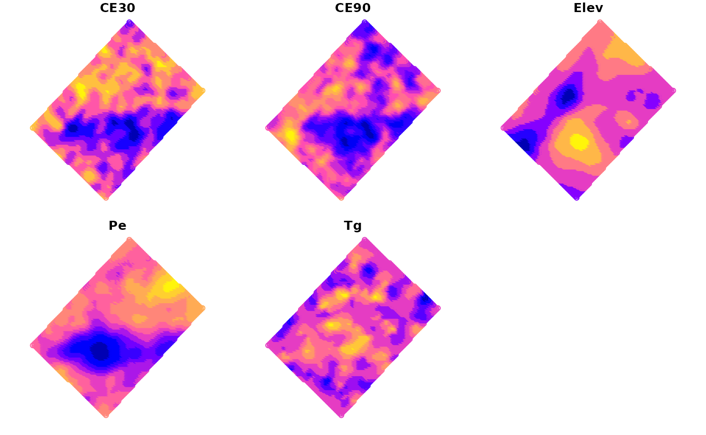
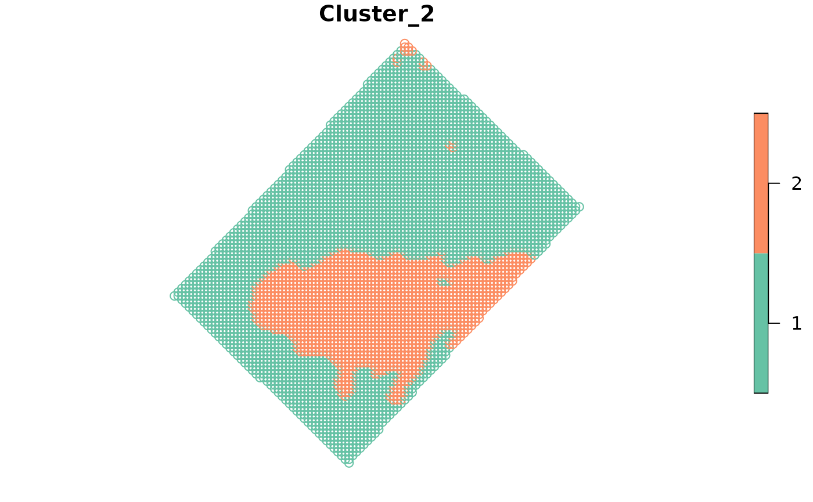
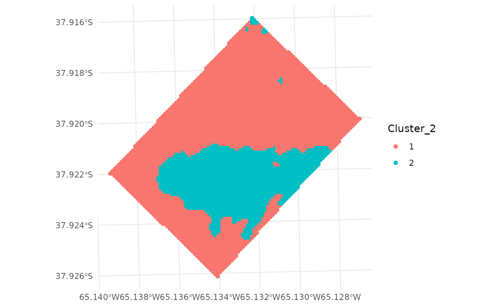

# Zone delineation

``` r
library(paar)
library(sf)
#> Linking to GEOS 3.12.1, GDAL 3.8.4, PROJ 9.4.0; sf_use_s2() is TRUE
require(ggplot2)
#> Loading required package: ggplot2
```

Multivariate zone delineation can be done using `kmspc` function,
whereas univariate zone delineation can be done with `fyzzy_k_means`
function.

Multivariate function implements the protocol proposed by Córdoba et al.
(2016), which performs a clustering with the `kmeans` function using as
an input the spatial principal components (sPC) of the data. The
function requires an `sf` object with the data to be clustered, and more
than one numeric variable. The function by default returns a list with
the following components: - `summaryResults`: a `data.frame` with -
`indices`: a `data.frame` with indices to help to chose the optimal
number of clusters. - `cluster`: the cluster number assigned to each
observation.

For this example we will use the `wheat` dataset that comes with the
`paar` package. The `data.frame` has apparent electrical conductivity
(ECa) measured at two depths, elevation data, soil depth, and wheat gran
yield. All variables have been interpolated to an unique grid and then
merged in a single `data.frame`.

``` r
data(wheat, package = 'paar')

wheat_sf <- st_as_sf(wheat,
                     coords = c('x', 'y'),
                     crs = 32720)
```

``` r
plot(wheat_sf)
```



The function `kmspc` requires the `sf` object with the data to be
clustered, and the number of clusters (zones) to be delineated. For the
sPC process, is necessary to specify the distance in which observations
will be considered neighbors. The `ldist` and `udist` arguments specify
the lower and upper distance thresholds, respectively. The
`explainedVariance` argument specifies the minimum value of explained
variance that the Principal Component to be used for the cluster process
should explain. The `center` argument specifies if the data should be
centered before the sPC process (default `TRUE`).

``` r
# Run the kmspc function
kmspc_results <- 
  kmspc(wheat_sf,
        number_cluster = 2:4,
        explainedVariance = 70,
        ldist = 0,
        udist = 40,
        center = TRUE)
#> Warning: All numeric Variables will be used to make clusters
```

To help the user to chose the optimal number of clusters, the function
returns a `data.frame` with indices (`Xie Beni`,
`Partition Coefficient`, `Entropy of Partition`, and `Summary Index`).
The `Summary Index` is a combination of the indices to obtain a measure
of the information reported by each index. In this example, the optimum
number of cluster is 2. For each index, lower the value better the
clustering. More information can be found in Paccioretti, Córdoba, and
Balzarini (2020).

``` r
kmspc_results$indices
#>   Num. Cluster     Xie Beni Partition Coefficient Entropy of Partition
#> 1            2 3.521080e-05             0.9611962           0.06490329
#> 2            3 5.479198e-05             0.9391147           0.10430166
#> 3            4 5.826635e-05             0.9293043           0.12351022
#>   Summary Index
#> 1      1.281143
#> 2      1.597505
#> 3      1.713109
```

The cluster for each observation can be found in the `cluster` component
of the `kmspc` object. The `cluster` component is a `data.frame` with
the cluster number assigned to each observation.

``` r
head(kmspc_results$cluster)
#>      Cluster_2 Cluster_3 Cluster_4
#> [1,] "1"       "2"       "4"      
#> [2,] "1"       "2"       "4"      
#> [3,] "1"       "2"       "4"      
#> [4,] "1"       "1"       "4"      
#> [5,] "1"       "1"       "4"      
#> [6,] "1"       "1"       "4"
```

The clusters can be combined to the original data using the `cbind`
function.

``` r
wheat_clustered <- cbind(wheat_sf, kmspc_results$cluster)
```

This cluster can be plotted with the `plot` function.

``` r
plot(wheat_clustered[, "Cluster_2"])
```



Also, ggplot can be used to plot the clusters.

``` r
ggplot(wheat_clustered) +
  geom_sf(aes(color = Cluster_2)) +
  theme_minimal()
```



Córdoba, Mariano, Cecilia Bruno, José Luis Costa, Nahuel Peralta, and
Mónica Balzarini. 2016. “Protocol for Multivariate Homogeneous Zone
Delineation in Precision Agriculture.” *Biosystems Engineering* 143
(March): 95–107. <https://doi.org/10.1016/j.biosystemseng.2015.12.008>.

Paccioretti, P., M. Córdoba, and M. Balzarini. 2020. “FastMapping:
Software to Create Field Maps and Identify Management Zones in Precision
Agriculture.” *Computers and Electronics in Agriculture* 175 (August).
<https://doi.org/10.1016/j.compag.2020.105556>.
